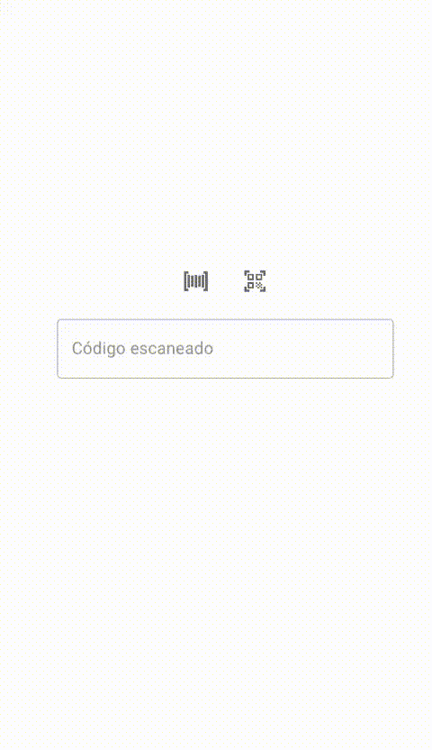
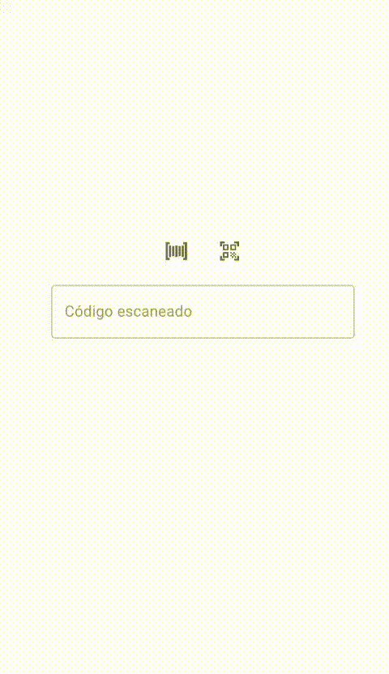
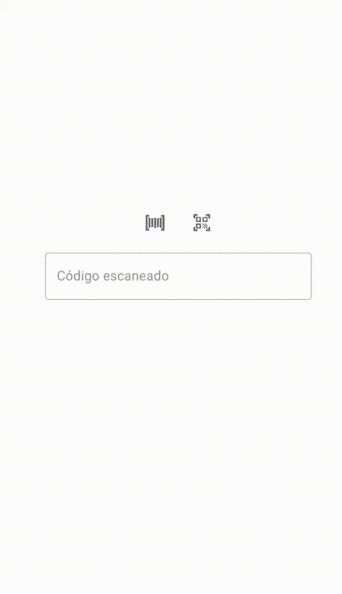
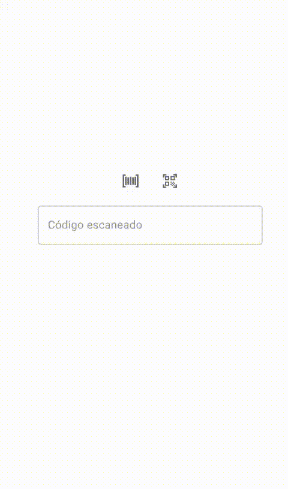

## 💻 Projeto

Implementação em JavaScript e ReactJS da biblioteca [quagga](https://github.com/serratus/quaggaJS) para leitura de código de barras e da biblioteca [react-qr-reader](https://github.com/JodusNodus/react-qr-reader) para leitura de QR code. Utilizado design system [MUI](https://mui.com/).

### Código de Barras

  
  

### QR Code

  

## ⚙ Execução

- Para rodar a [aplicação](https://barcode-qrcode-reader-felipebrenner.netlify.app/), tanto pelo deploy quanto desenvolvimento, recomendo que seja em dispositivo móvel, porque conforme meus testes a leitura ocorre com mais acertividade e rapidez do que com webcam.
- Só foi possível a abertura da câmera em dispositivo móvel utilizando HTTPS, para isso criei um .env na raiz do projeto com HTTPS=true. Pra adquirir licença, tanto pra executar o projeto no meu linux quanto no meu iOS, utilizei a ferramenta [mkcert](https://github.com/FiloSottile/mkcert). Basta seguir os passos descritos nela conforme o sistema operacional em que for executar. Instalado corretamente, a página será acessada sem erro e o acesso a câmera será solicitado ao primeiro acesso:

  

---

Por Felipe Brenner
